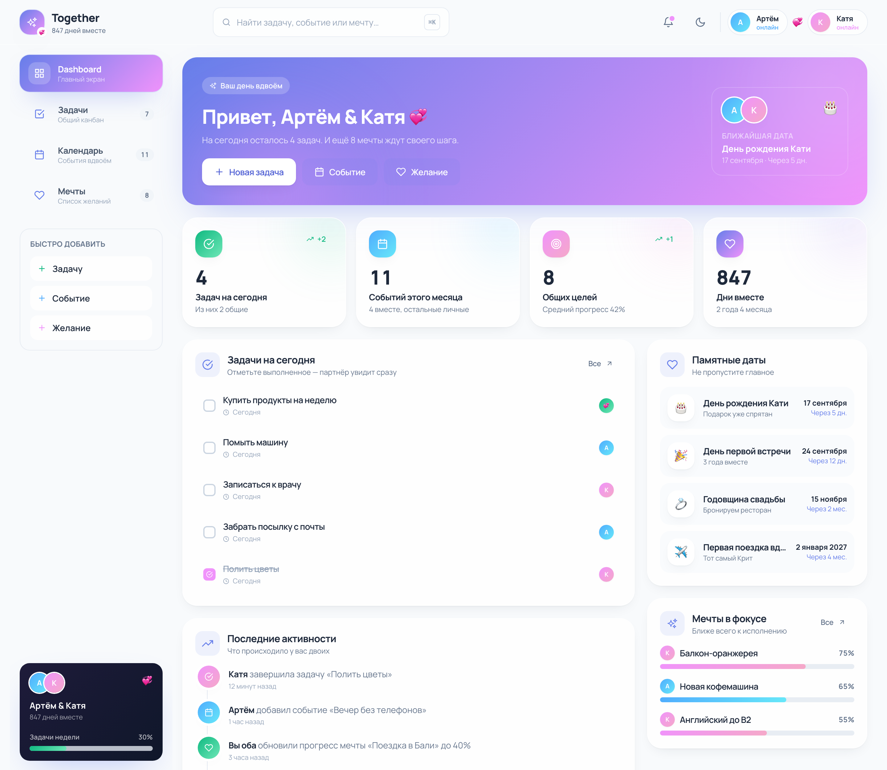
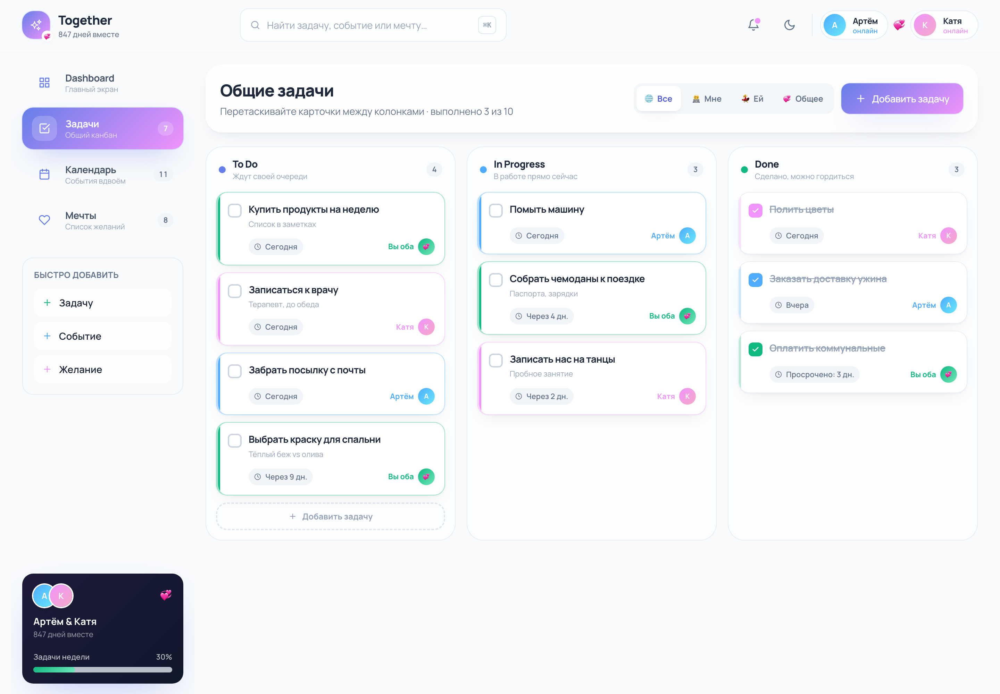
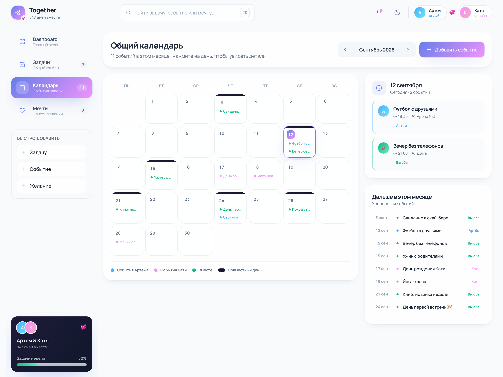
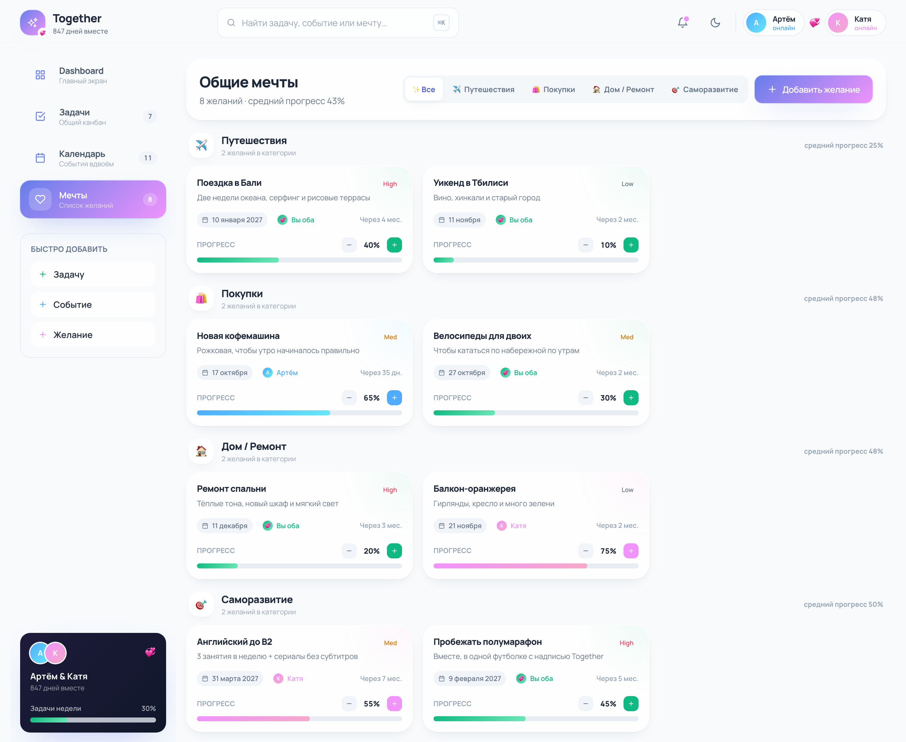
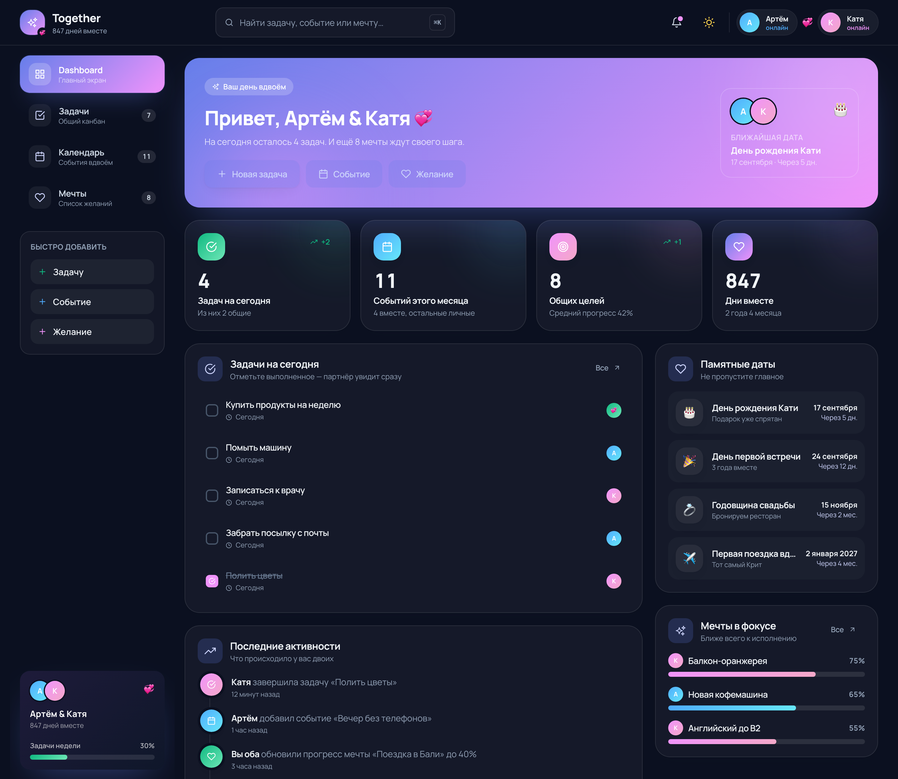
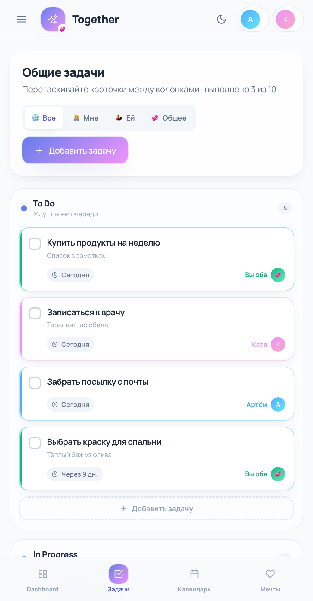

# Together — приложение для совместного управления жизнью

Версия 1.3: React UI на `:3000` + Express API и Socket.io на `:5050`.
Данные живут в SQLite, синхронизируются в реальном времени. Появились капсулы времени и общий бюджет.



## Запуск вместе

Нужны два терминала.

```bash
# 1. Backend
cd together-backend
npm install
npm run seed   # пересоздаёт БД — после этого нужно войти заново
npm start
# если 5000 занят AirPlay: PORT=5050 npm start
```

```bash
# 2. Frontend (корень репозитория)
cp .env.example .env   # VITE_API_URL=http://localhost:5050/api
npm install
npm start
```

Откройте [http://localhost:3000/login](http://localhost:3000/login).

Демо после seed:

| Кто | Email | Пароль |
| --- | --- | --- |
| Артём | `artem@together.app` | `together123` |
| Катя | `katya@together.app` | `together123` |

Код пары: `TOGETHER1`.

`npm run seed` полностью пересоздаёт SQLite. Старые JWT в `localStorage` перестают работать — фронт сам отправит на `/login`. Войдите снова демо-аккаунтом.

Если пары ещё нет — после входа откроется `/couple-setup`.

## Что синхронизируется

- JWT в `localStorage`, refresh при 401
- Задачи, события, мечты и лента — REST
- Создание/перемещение задач и прогресс мечт — сразу в БД
- Socket.io: изменения партнёра появляются без перезагрузки
- Капсулы времени и общий бюджет (сплит 50/50 или кастомный)

## Запуск только UI

```bash
npm install
npm start
```

Приложение откроется на [http://localhost:3000](http://localhost:3000). Без backend логин не заработает.

Другие команды:

| Команда | Что делает |
| --- | --- |
| `npm start` / `npm run dev` | dev-сервер Vite на порту 3000 |
| `npm run build` | production-сборка в `dist/` |
| `npm run preview` | локальный просмотр собранной версии |

Экраны: `/`, `/tasks`, `/calendar`, `/wishes`, `/capsules`, `/budget`.
Тему можно принудительно задать параметром `?theme=light` или `?theme=dark` (по умолчанию
берётся сохранённая, а при первом визите — системная).

## Стек

- **React 18** + **Vite** — быстрый dev-сервер и HMR
- **Tailwind CSS 3** — дизайн-система в `tailwind.config.js` (цвета, градиенты, анимации)
- **React Icons** (Feather + Hero Icons) — иконки
- Состояние — React Context (`src/context/AppContext.jsx`), без внешних стор-библиотек
- Drag & drop — нативный HTML5 Drag and Drop, без зависимостей

## Экраны

### 1. Dashboard

Метрики (задачи на сегодня, события месяца, общие цели, дни вместе), быстрые действия,
лента активностей, памятные даты и мечты в фокусе.

### 2. Shared Tasks — канбан



Три колонки `To Do / In Progress / Done`, карточки с ответственным, сроком и цветовым
кодом. Перетаскивание между колонками, чекбокс завершения, фильтры «Все / Мне / Ей / Общее».

### 3. Shared Calendar



Месячная сетка, события с цветом по участнику, тёмная полоса на днях с совместными
событиями, панель деталей выбранного дня и хронология месяца.

### 4. Wishes — общие мечты



Группировка по категориям (✈️ Путешествия, 🛍️ Покупки, 🏠 Дом/Ремонт, 🎯 Саморазвитие),
приоритет Low/Med/High, дата желаемого завершения, владелец и прогресс с шагом ±10%.

### 5. Time Capsules

Письма и фото с опциональной датой открытия. Закрытая капсула скрывает содержимое до нужного дня;
в день открытия — 🎉. Автор может удалить, ссылку можно скопировать.

### 6. Shared Budget

Расходы пары, категории, кто платил, сплит 50/50 или кастомный процент, баланс «кто кому должен»
и pie-чарты (recharts).

### Тёмная тема и мобильная версия

| Dark mode | Мобильный экран |
| --- | --- |
|  |  |

## Дизайн-система

| Роль | Цвет |
| --- | --- |
| Основной | `#667eea` (`brand`) |
| Акцент «Она» | `#f093fb` (`her`) |
| Акцент «Он» | `#4facfe` (`him`) |
| Общее | `#10b981` (`both`) |
| Фон | `#f8fafc` (`canvas`), тёмный — `#0b1020` |
| Текст | `#1e293b` (`ink`) |

Цвет всегда отвечает на вопрос «чьё это»: синий — Артём, розовый — Катя, зелёный — общее.
Поверхности собраны в утилиты `.surface`, `.field`, `.chip` (см. `src/index.css`).

## Структура

```
together-mvp/
├── index.html
├── tailwind.config.js
├── postcss.config.js
├── vite.config.js
├── public/
│   └── favicon.svg
├── screenshots/           # скриншоты + скрипт съёмки
└── src/
    ├── main.jsx
    ├── App.jsx
    ├── index.css
    ├── components/
    │   ├── Header.jsx
    │   ├── Sidebar.jsx
    │   ├── Dashboard.jsx
    │   ├── TaskBoard.jsx
    │   ├── Calendar.jsx
    │   ├── Wishes.jsx
    │   ├── TimeCapsules/
    │   ├── Budget/
    │   ├── Modals.jsx
    │   └── shared/
    │       ├── Avatar.jsx
    │       ├── Button.jsx
    │       ├── Card.jsx
    │       ├── Modal.jsx
    │       ├── OwnerPicker.jsx
    │       └── ProgressBar.jsx
    ├── context/
    │   └── AppContext.jsx
    ├── data/
    │   └── mockData.js
    ├── pages/
    │   ├── Home.jsx
    │   └── index.jsx
    └── utils/
        └── helpers.js
```

## Что интерактивно

- Переключение разделов (сайдбар, нижняя навигация на мобильном, hash-ссылки)
- Модалки «Добавить задачу / событие / желание» — с валидацией пустого названия,
  закрытием по `Esc`, клику по фону и `Enter` для отправки
- Drag & drop задач между колонками канбана
- Чекбокс завершения задачи (зачёркивание + запись в ленту активностей)
- Удаление задачи по наведению на карточку
- Клик по дню календаря — детали дня; переключение месяцев
- Прогресс мечты ±10%
- Переключатель тёмной/светлой темы (сохраняется в `localStorage`)
- Фильтры задач по владельцу и мечт по категориям

Добавленные объекты попадают в ленту активностей и пересчитывают метрики на Dashboard.

## Production Deploy (Vercel + Railway)

Полный стек: API на [Railway](https://railway.app) (`together-backend/`), UI на [Vercel](https://vercel.com) (корень репо).

### Backend (Railway)

1. New Project → Deploy from GitHub → этот репозиторий, **Root Directory: `together-backend`**.
2. Add PostgreSQL. Railway сам добавит `DATABASE_URL`.
3. Variables: см. `together-backend/.env.production.example` (`NODE_ENV`, JWT-секреты 32+, `CORS_ORIGIN`, `PUBLIC_API_URL`).
4. Проверка: `https://<сервис>.up.railway.app/health` и `/api/docs`.

Подробности — в `together-backend/README.md`.

### Frontend (Vercel)

1. New Project → этот репозиторий. Framework: **Vite**, Root: `.`, Build: `npm run build`, Output: `dist`.
2. Environment Variables **до** первого успешного продакшен-деплоя (иначе нужен Redeploy):

```
VITE_API_URL=https://<сервис>.up.railway.app/api
VITE_SOCKET_URL=https://<сервис>.up.railway.app
VITE_WS_URL=https://<сервис>.up.railway.app
VITE_APP_NAME=Together
```

3. `vercel.json` уже редиректит SPA-роуты на `index.html`.
4. Скопируйте URL вида `https://<проект>.vercel.app` в Railway `CORS_ORIGIN` и рестартните API.

Локальная проверка сборки:

```bash
npm run build
npm run preview
```

Шаблоны переменных: `.env.production.example` и `together-backend/.env.production.example`. Файлы `.env` / `.env.production` в git не попадают.

## Скриншоты

Пересобрать скриншоты (нужен установленный Google Chrome и запущенный dev-сервер):

```bash
bash screenshots/capture.sh
```
